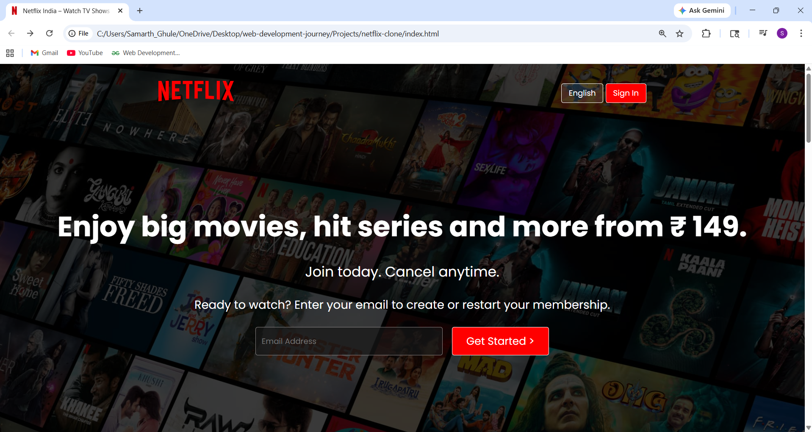
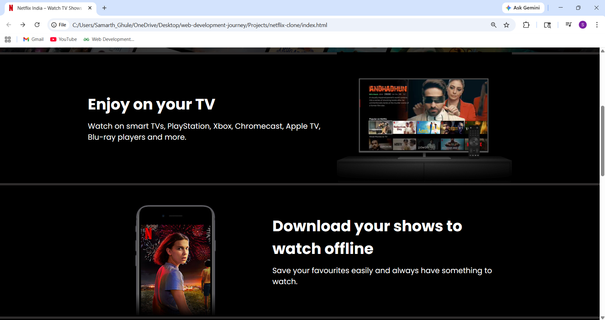
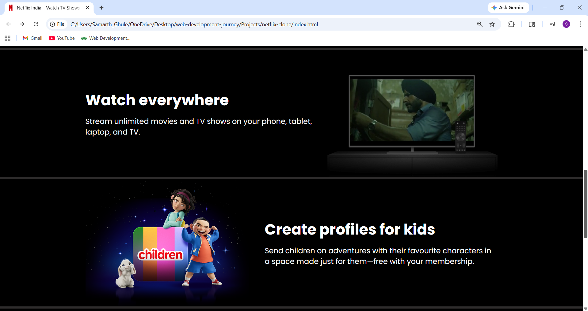
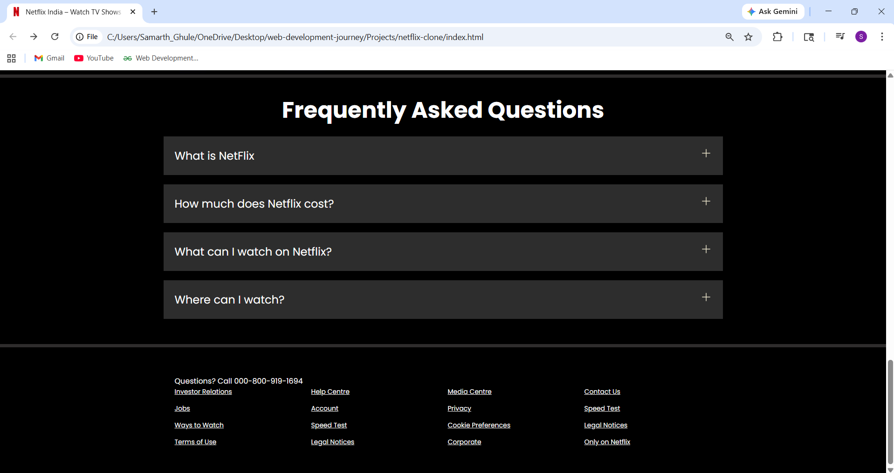

# 🎬 Netflix Clone

A simple Netflix landing page clone built using HTML and CSS.

## 🚀 Live Demo
https://samarth-ghule2006.github.io/netflix-clone/

### 🏠 Homepage

### 📺 TV Section

### 📥 Download Section

### ❓ FAQ Section

## 🛠️ Tech Used
- HTML
- CSS

## 📸 Features
- Responsive design
- Hero section with background
- FAQ section
- Footer layout

## 📁 Folder Structure

Projects/netflix-clone/
│── index.html
│── style.css
│── assets/

## 📌 What I Learned
- Flexbox & layout design
- Positioning elements
- Responsive design basics
- Deploying using GitHub Pages

## 👨‍💻 Author
Samarth Ghule